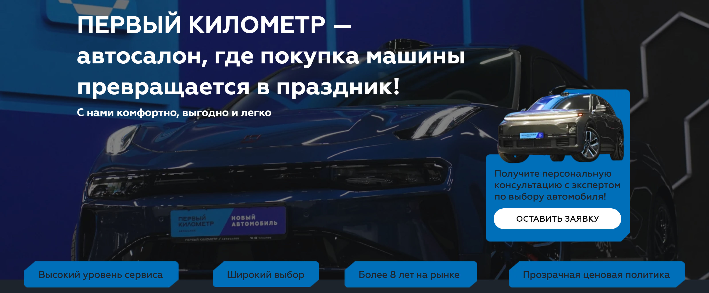
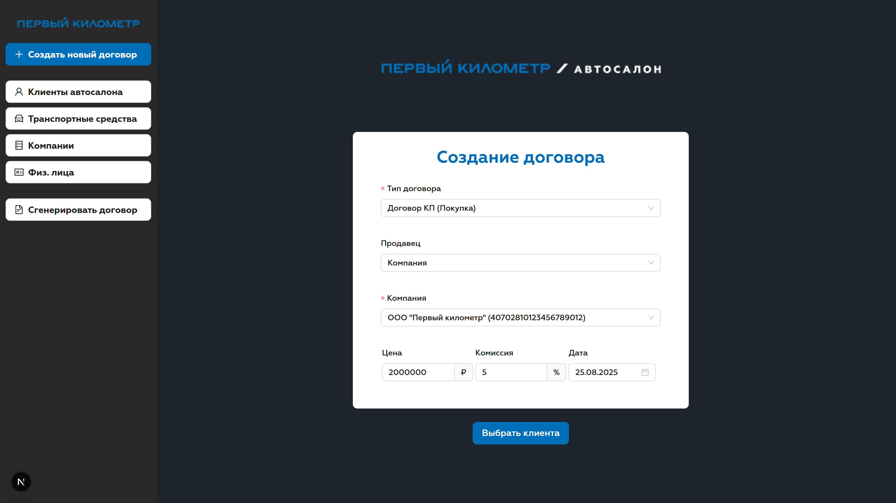
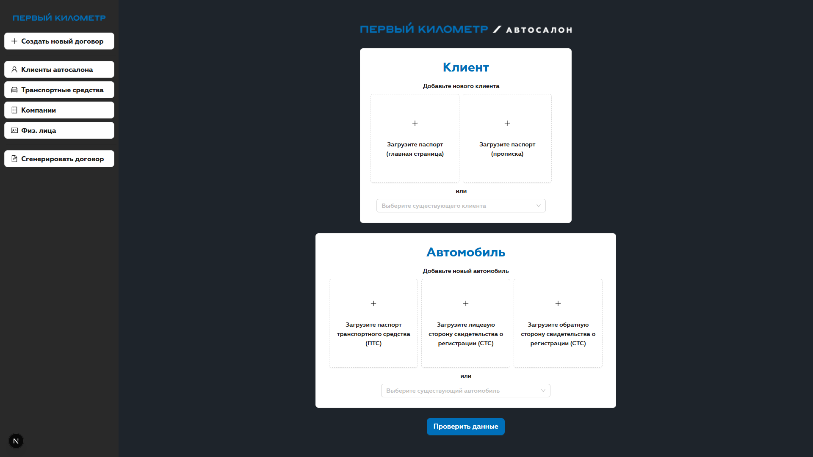
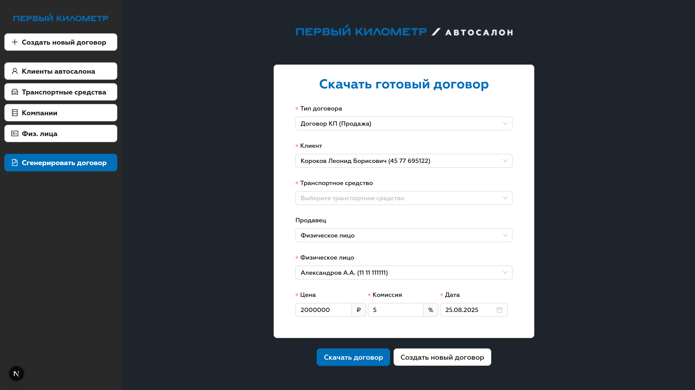
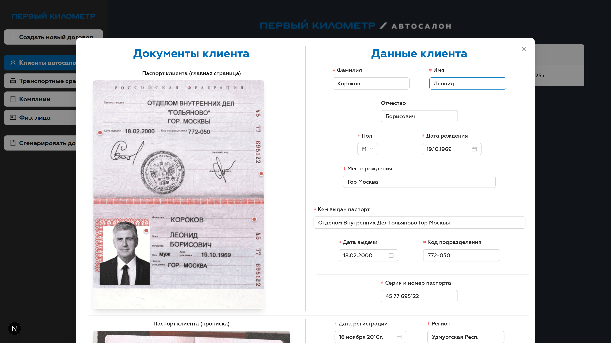
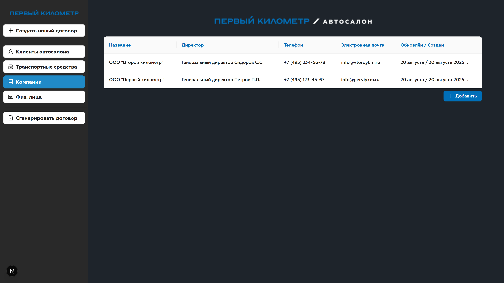

# Система распознавания и генерации документов автосалона "Первый километр"

> Автоматическая генерация документов с использованием данных клиентов, извлечённых из отсканированных документов с помощью конвейера OCR нейронных сетей

## Стек:
- Frontend
  - [TypeScript](https://www.typescriptlang.org)
  - [React](https://react.dev) 19
  - [Next.js](https://nextjs.org) 15 (App Router)
  - [Ant Design](https://ant.design) 5
  - [SWR](https://swr.vercel.app/ru)
  - [Zod](https://zod.dev)
- Backend:
  - [Python](https://www.python.org) 3.12
  - [Django](https://www.djangoproject.com) 5.2.4
  - [Paddle](https://github.com/PaddlePaddle/Paddle) 3.1
  - [RapidFuzz](https://github.com/rapidfuzz/RapidFuzz)

## О проекте:

- Загрузка паспорта клиента (главный разворот и прописка), паспорта транспортного средства и свидетельства о регистрации транспортного средства
- Распознавание документов с использованием конвейера [OCR](https://ru.wikipedia.org/wiki/Оптическое_распознавание_символов) нейронных сетей
- Доработка распознанного текста с использованием [RapidFuzz](https://github.com/rapidfuzz/RapidFuzz)
- Форма валидации распознанных данных, для проверки качества и исправления ошибок
- Генерация договоров различных типов из шаблонов с использованием распознанных данных
- Сохранение клиентов автосалона, транспортных средств и филиалов в БД
- REST FULL API для работы с основными сущностями
- Валидация данных всех запросов и форм с использованием [Zod](https://zod.dev)

## Скриншоты:

